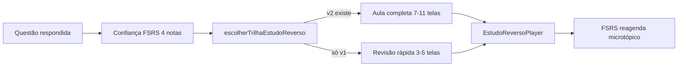

# Estudo Reverso Visual — Documentação completa (v3.4)

Documentação de referência para produção, validação, integração no app e retrofit de conteúdo legado.

| Documento | Papel |
|-----------|--------|
| [SKILL.md](./SKILL.md) | Instruções operacionais para o Agent (geração) — **v3.4** |
| [checklist-mayer.md](./checklist-mayer.md) | Gate Mayer 8/8 + editorial #18/#19 (E1–E3) |
| [exemplos-ouro/PADRAO-AULA-COMPLETA-v3.md](./exemplos-ouro/PADRAO-AULA-COMPLETA-v3.md) | **Hub padrão ouro v3.4** — famílias A–D, transferência |
| [../examinador-idecan/SKILL.md](../examinador-idecan/SKILL.md) | Questão IDECAN — **v2.1** (`near_transfer`, `far_transfer`, `eixo_vizinho`) |
| [../examinador-idecan/prompt-nova-conversa.txt](../examinador-idecan/prompt-nova-conversa.txt) | **Prompt pronto** — copiar e colar (nova conversa Agent) |
| [../examinador-idecan/prompt-questao-aula-completa.md](../examinador-idecan/prompt-questao-aula-completa.md) | Variantes do prompt + checklist pós-geração |
| [exemplos-ouro/familias/](./exemplos-ouro/familias/) | Guias por família |
| [exemplos-ouro/PADRAO-AULA-COMPLETA-v2.md](./exemplos-ouro/PADRAO-AULA-COMPLETA-v2.md) | Legado Família A (MÉTODO linear) |
| [arquetipos/](./arquetipos/) | Templates por componente visual |
| [exemplos-ouro/](./exemplos-ouro/) | Questões de referência que passam no validador |
| `.cursor/rules/03-estudo-reverso.mdc` | Motor pedagógico (FSRS, player, trilhas) |
| `.cursor/rules/02-questoes-idecan.mdc` | Schema JSON da questão |

---

## 0. Nova conversa Agent (1 questão)

1. Copiar [../examinador-idecan/prompt-nova-conversa.txt](../examinador-idecan/prompt-nova-conversa.txt) inteiro → colar em conversa **Agent**.
2. Agente executa `npm run proxima -- legislacao_transito` (ou outra disciplina — trocar no `.txt`).
3. Pipeline esperado: gravar lote → `grifo:offsets` → `validate:lote` (5 gates) → `index:questoes` → `db:seed`.
4. Checklist humano: [../examinador-idecan/prompt-questao-aula-completa.md](../examinador-idecan/prompt-questao-aula-completa.md) § checklist pós-geração.

Variantes (escopo manual, lote, outras disciplinas): mesmo arquivo `.md` acima.

---

## 1. Visão geral

O **estudo reverso visual** é a micro-aula segmentada que abre **automaticamente** após o aluno confirmar a resposta no modo estudo. Cada aula é **exclusiva da questão** — nunca genérica, nunca reusada entre microtópicos.

A skill **v3.4** unifica dois modos que coexistem no mesmo JSON da questão. A questão-mãe vem do **examinador-idecan v2.1** com `meta.near_transfer`, `meta.far_transfer`, `meta.o_que_nao_muda` e `meta.eixo_vizinho` (quando couber).



**Recall não fica na aula.** O testing effect vem da própria questão; a reexposição espaçada é FSRS (`micro_recall` removido em 2026-07).

---

## 2. Os dois modos

| | EXPRESSA (v1) | COMPLETA (v2) |
|---|---|---|
| Campo JSON | `estudo_reverso_visual` | `estudo_reverso_visual_completo` |
| `versao` | `1` | `2` obrigatório |
| Telas | 3–5 | 7–11 |
| Palavras/tela | ≤ 120 | ≤ 150 |
| Duração típica | 30–60 s | 120–300 s (`duracao_estimada_seg`) |
| Uso no app | Fallback legado | **Trilha padrão** |
| Badge no player | "Revisão rápida" | "Aula completa" |
| Coluna DB | `estudo_reverso_visual_json` | `estudo_reverso_visual_completo_json` |

### Política de seed

| Campo | Obrigatoriedade |
|-------|-----------------|
| `estudo_reverso_visual_completo` | **Obrigatório** em toda questão importada |
| `estudo_reverso_visual` | **Recomendado** — não bloqueia seed; útil como fallback e revisão rápida |

Quando ambos existem: **nunca substituir v1 por v2**; retrofit = adicionar v2 sem alterar v1.

---

## 3. Estrutura das trilhas

### 3.1 Modo EXPRESSA (3–5 telas)

**Núcleo obrigatório (3):**
1. `texto_destaque` — o que a IDECAN testou
2. Arquétipo principal (ver [tabela de decisão](./SKILL.md#tabela-de-decisão-do-arquétipo-principal-com-desempate))
3. `texto_destaque` — macete visual (**inclui far-transfer em 1 linha** quando `meta.far_transfer` existe)

**Condicionais (+até 2):**
- `comparacao` — par confundível da pegadinha
- `trecho_legal` grifado — pegadinha na letra da lei

### 3.2 Modo COMPLETA (7–11 telas)

**Núcleo obrigatório (7), nesta ordem:**
1. `texto_destaque` — o que a IDECAN testou
2. Arquétipo principal
3. `comparacao` — contraste da pegadinha
4. `comparacao` — **distratores por mecanismo** (`id: "distratores"`)
5. `comparacao` ou `fluxograma` — caso do enunciado resolvido
6. `trecho_legal` — dispositivo principal grifado
7. `texto_destaque` — macete (**regra + near + far + o que NÃO muda**; citar `eixo_vizinho` se houver)

**Transferência (v3.4):** o macete consome `meta` da questão (`examinador-idecan` v2.1). Gate editorial **#18** (far ≠ near) e **#19** (checklist E1–E3). Ver [PADRAO-AULA-COMPLETA-v3.md](./exemplos-ouro/PADRAO-AULA-COMPLETA-v3.md).

**Condicionais (+até 4, antes do arquétipo quando forem pré-treino):**
- glossário (≤3 termos)
- `linha_tempo` (alteração legal)
- segundo `trecho_legal`
- `comparacao` extra (segundo par confundível)

**Padrão ouro v3.4:** [PADRAO-AULA-COMPLETA-v3.md](./exemplos-ouro/PADRAO-AULA-COMPLETA-v3.md) — hub + famílias A–D + transferência. Piloto: `lote-127` (art. 280 §2). Referência Família A: `lote-007` / `ctb-normas-circulacao-art29.json`.

### 3.3 Slide MÉTODO — fluxograma linear (v3.1, 2026-07-08)

Na aula completa v2, a tela `fluxo` com `secao: "metodo"` **não** replica a árvore de decisão da lei. Ela mostra apenas o **caminho que o enunciado percorre até o gabarito**.

| Regra | Detalhe |
|-------|---------|
| Forma | Cadeia linear (1 raiz → 1 folha), sem bifurcações |
| Nós | ≤ 4 total |
| Perguntas | ≤ 2 nós `tipo: pergunta` |
| Resultado | Exatamente 1 nó `tipo: resultado` |
| Labels | Português simples; **sem** `art.` / inciso no texto do nó |
| Onde vai o resto | `mapa` (tabela_gradacao) = árvore completa; `caso` = fatos × lei; `trecho_legal` = citação literal |

**Implementação no app**

| Artefato | Caminho |
|----------|---------|
| Validação Zod | `validarLimitesComponente` em `src/lib/validations/estudo-reverso-visual.ts` |
| Ordenação linear no player | `src/lib/estudo-reverso/fluxograma-caminho.ts` |
| Renderer | `src/components/estudo-reverso/telas/tela-fluxograma.tsx` |

**Retrofit aplicado:** `content/questoes/legislacao_transito/lote-006.json` … `lote-019.json` + snippets + exemplos ouro.

**Exceção:** questões `letra_de_lei` (ex. lote-006) usam fluxo **procedural** (caça palavra a palavra) — ainda linear, mas pode incluir nó `acao` em vez de só `pergunta`/`resultado`.

---

## 4. Mapeamento arquetipo → `tipo` de tela

O campo raiz `arquetipo` descreve a estratégia pedagógica. Cada tela usa `tipo` no JSON:

| `arquetipo` (raiz) | `tipo` da tela |
|--------------------|----------------|
| `fluxograma_decisao` | `fluxograma` |
| `comparacao` | `comparacao` |
| `matriz_assertivas` | `matriz_assertivas` |
| `tabela_gradacao` | `tabela_gradacao` |
| `trecho_legal` | `trecho_legal` |
| `linha_tempo` | `linha_tempo` |
| `diagrama_competencia` | `diagrama_competencia` |
| `texto_destaque` | `texto_destaque` |

`arquetipo_secundario` opcional quando a trilha mistura dois componentes.

---

## 5. Distratores por mecanismo IDECAN

Integração com `examinador-idecan` v2.0: cada alternativa errada tem um **slug de mecanismo** no `passo_a_passo` do comentário.

| Slug | Mecanismo |
|------|-----------|
| `numero_vizinho` | Troca de número/prazo/velocidade/valor |
| `competencia_snt` | Inversão CONTRAN↔CETRAN↔municipal↔PRF… |
| `gravidade` | Troca leve/média/grave/gravíssima |
| `regra_excecao` | "sempre"/"vedado" onde há exceção |
| `termo_unico` | Um termo trocado (~90% do texto igual) |

### Formato canônico da tela de distratores (v2)

```json
{
  "id": "distratores",
  "titulo": "Por que cada alternativa erra",
  "tipo": "comparacao",
  "conteudo": {
    "colunas": ["Alternativa", "Mecanismo + por quê"],
    "linhas": [
      ["A — regra_excecao", "Trata recusa como impedimento — art. 165-A é infração autônoma."],
      ["B — termo_unico", "Confunde autuação administrativa com perícia criminal."],
      ["D — regra_excecao", "Exige confirmação no etilômetro — a recusa já configura infração."]
    ]
  }
}
```

Exemplo completo: [exemplos-ouro/ctb-embriaguez.json](./exemplos-ouro/ctb-embriaguez.json).  
Padrão ouro v3: [PADRAO-AULA-COMPLETA-v3.md](./exemplos-ouro/PADRAO-AULA-COMPLETA-v3.md) + famílias. Legado: [ctb-normas-circulacao-art29.json](./exemplos-ouro/ctb-normas-circulacao-art29.json).

---

## 6. Gate Mayer (8/8)

Checklist bloqueante **antes** de rodar qualquer `npm run validate:*`. Espelho em [checklist-mayer.md](./checklist-mayer.md).

| # | Critério | Automatizado (Zod) |
|---|----------|-------------------|
| 1 | 1 ideia por tela (≤5 s) | — (revisão humana) |
| 2 | Sem 2 `texto_destaque` seguidos | ✅ (exceções: contexto→glossário; qualquer→macete) |
| 3 | `<cadeia_anti_alucinacao>` em todo dado legal | Parcial (`validate:questoes` citações) |
| 4 | Distratores com slug por errada (v2) | ✅ |
| 5 | Arquétipo expõe a pegadinha | — (revisão humana) |
| 6 | Limites por componente + **núcleo v2 (ordem)** | ✅ |
| 7 | Zero decoração | — (revisão humana) |
| 8 | Coerência v1↔v2 | ✅ (script visual quando ambos existem) |

### Limites por componente (item 6)

| Componente | Limite |
|------------|--------|
| Palavras/tela v1 | ≤ 120 |
| Palavras/tela v2 | ≤ 150 |
| `macete_visual` | ≤ 80 caracteres |
| `fluxograma` MÉTODO (`secao: metodo`) | ≤ 4 nós, cadeia linear, 1 `resultado`, sem `art.` no `label` |
| `fluxograma` (demais) | ≤ 7 nós, ≤ 2 nós `pergunta` |
| `comparacao` | ≤ 5 linhas |
| `tabela_gradacao` | ≤ 5 faixas |
| `linha_tempo` | ≤ 6 eventos |
| `matriz_assertivas` | ≤ 5 itens |
| `diagrama_competencia` | ≤ 8 nós |
| `trecho_legal` | ≤ 80 palavras, ≤ 3 grifos |

---

## 7. Validação (npm)

### Comandos

```bash
# Gate único (recomendado) — encadeia validadores (5 em inéditas; 6 em questoes-reais/)
npm run validate:lote -- content/questoes/legislacao_transito/lote-001.json
npm run validate:lote -- content/questoes-reais/legislacao_transito/lote-001.json

# Sem corpus legal (rascunho / CI)
npm run validate:lote -- arquivo.json --skip-citacoes

# Lotes legados (até retrofit)
npm run validate:lote -- arquivo.json --legacy-grifos          # sem texto_grifado
npm run validate:lote -- arquivo.json --legacy-transferencia   # sem meta near/far/o_que_nao_muda (nível 4+)
npm run validate:lote -- arquivo.json --legacy-aula-real       # só questoes-reais — pula paridade aula
npm run validate:lote -- arquivo.json --legacy-grifos --legacy-transferencia

# Validadores individuais
npm run validate:questoes -- arquivo.json
npm run validate:indistinguibilidade -- arquivo.json
npm run validate:estudo-reverso-visual -- arquivo.json
npm run validate:aula-real -- content/questoes-reais/.../lote.json
```

### Gates por tipo de lote

| Gate | Inéditas (`content/questoes/`) | Reais (`content/questoes-reais/`) |
|------|-------------------------------|-----------------------------------|
| `validate:questoes` | ✓ | ✓ |
| `validate:cobertura` | ✓ | ✓ |
| `validate:indistinguibilidade` | ✓ | ✓ (D1/C6 relaxados para `real_idecan`) |
| `validate:estudo-reverso-visual` | ✓ | ✓ |
| `preview:grifos` | ✓ | ✓ |
| **`validate:aula-real`** | — | ✓ (paridade Crença×Lei, macete Near/Far/Não muda, meta E1–E3) |

O 6º gate é acionado automaticamente quando o path contém `questoes-reais/` (`scripts/validate-lote.ts`). Critérios: `scripts/validate-aula-real.ts` e `content/questoes-reais/_ouro/real-aula-nota-10.md`.

### Pipeline completo de lote novo

```bash
npm run validate:lote -- content/questoes/.../lote.json
npm run db:seed
```

### Pipeline questão real (superior)

```bash
npm run validate:lote -- content/questoes-reais/.../lote.json
npm run db:seed:reais
```

Prompt: `.cursor/skills/examinador-idecan/prompt-questao-real-aula.md` · README: `content/questoes-reais/README.md`

### Enforcement automático (v3.1)

| Regra | Onde |
|-------|------|
| `estudo_reverso_visual_completo` obrigatório | `questaoSeedImportSchema` (seed + validate:lote) |
| Transferência pedagógica (nível 4+) | `validarTransferenciaPedagogica` em `transferencia-pedagogica.ts` — `meta.near_transfer`, `far_transfer`, `o_que_nao_muda`; `eixo_vizinho` se gabarito remete a outro artigo; macete ecoa meta |
| Transferência em **reais** (`real_idecan`) | Mesmos campos **sempre** (mesmo dificuldade 1–3) + `padrao_familia`, `isca_por_alternativa`, `eficacia_pos_aula` E1–E3 |
| Paridade aula real | `validate:aula-real` — 7–11 telas, contraste Crença×Lei, macete Near/Far/Não muda, sem "stem" no título |
| Modo legado transferência | `--legacy-transferencia` ou `TRANSFERENCIA_LEGACY=1` — pula gate T1–T4 em lotes antigos |
| Passo 2 com slug por errada | `validarPasso2Mecanismos` em `questao-mecanismo.ts` |
| Núcleo v2 (ordem das 7 telas) | `validarNucleoV2` em `estudo-reverso-visual.ts` |
| Fluxograma MÉTODO linear | `validarLimitesComponente` — `secao === "metodo"` |
| Pre-commit em lotes staged | `npm run setup:git-hooks` |
| CI em PR/push | `.github/workflows/validate-questoes.yml` |

Schema **rascunho** (v2 opcional): `questaoSeedSchema` — só para exemplos parciais; **não** passa no seed.

### O que o validador Zod verifica

Implementação: `src/lib/validations/estudo-reverso-visual.ts` + `src/lib/validations/transferencia-pedagogica.ts`

- Schema v1: `versao: 1`, 3–5 telas, limites v1
- Schema v2: `versao: 2`, 7–11 telas, tela distratores obrigatória, limites v2
- **Transferência (nível 4+, gate T1–T4):** `meta.near_transfer` + `far_transfer` + `o_que_nao_muda` obrigatórios; `far_transfer` ≠ paráfrase de `near_transfer`; `eixo_vizinho` se comentário remete a outro artigo; tela `macete` ecoa os três campos
- Fluxograma MÉTODO (`secao: "metodo"`): ≤4 nós, 1 resultado, grafo linear, labels sem `art.`
- Coerência v1↔v2 (quando ambos presentes):
  - `fundamento_slug` idêntico
  - `arquetipo` idêntico
  - `macete_visual` com pelo menos um token ≥4 caracteres em comum

Constante exportada: `MECANISMOS_DISTRATOR` (lista de slugs válidos).

---

## 8. Schema JSON (campos raiz do visual)

```json
{
  "versao": 2,
  "arquetipo": "fluxograma_decisao",
  "arquetipo_secundario": "comparacao",
  "publico_alvo": "iniciante",
  "duracao_estimada_seg": 180,
  "fundamento_slug": "CTB_art_165-A",
  "macete_visual": "RECUSA = 165-A (infração autônoma)",
  "telas": [],
  "links_fonte": [
    { "rotulo": "CTB art. 165-A", "path": "conteúdo/legislação federal/" }
  ],
  "ref_visual_id": "opcional"
}
```

Tipos TypeScript: `src/types/estudo-reverso-visual.ts`  
Discriminated union por `telas[].tipo`.

---

## 9. Integração no app

| Peça | Caminho |
|------|---------|
| Roteamento v2 > v1 | `src/lib/estudo-reverso-visual-trilha.ts` |
| Label da trilha | `labelTrilhaEstudoReverso()` → "Aula completa" / "Revisão rápida" |
| Player | `src/components/estudo-reverso/estudo-reverso-player.tsx` |
| Trigger pós-resposta | `src/components/estudo/questao-view.tsx` |
| Renderers por tipo | `src/components/estudo-reverso/` |
| UI / acessibilidade | `.cursor/skills/frontend-design/retencao-visual.md` |

Fluxo:
1. Aluno confirma resposta → coleta confiança FSRS (4 notas)
2. `escolherTrilhaEstudoReverso(v1, v2)` → prioriza v2
3. Player segmentado até macete/fechamento
4. FSRS persiste agendamento; sem recall dentro da aula

---

## 10. Workflow de geração (Agent)

1. `examinador-idecan` → questão + `passo_a_passo` com slugs de mecanismo
2. `estudo-reverso-visual` v3 → montar v2 (obrig.) + v1 (recom.)
3. Gate Mayer 8/8 por aula
4. Validadores npm até zero erros
5. Seed (`npm run db:seed`)

### Prompt de lote

Ver seção em [SKILL.md](./SKILL.md#prompt-de-lote-agent-mode).

---

## 11. Retrofit de conteúdo legado

Lotes anteriores à v3 podem falhar no validador por:

| Problema comum | Correção |
|----------------|----------|
| Distratores sem slug | Reescrever tela `distratores` no formato canônico (§5) |
| `fundamento_slug` diferente entre v1 e v2 | Unificar slug em ambos os campos |
| 10 telas fixas sem gatilho | Reestruturar como núcleo 7 + condicionais reais |
| `micro_recall` em telas | Remover — recall é questão + FSRS |
| Macetes contraditórios v1↔v2 | Alinhar mensagem central (mesmo artigo/dispositivo) |

**Estratégia recomendada:** retrofit por lote ao editar; novos lotes já nascem no padrão v3. Não é necessário reescrever todo o acervo de uma vez.

### Checklist de retrofit por questão

- [ ] `estudo_reverso_visual_completo` presente (7–11 telas)
- [ ] Tela `distratores` com slugs IDECAN
- [ ] `passo_a_passo` passo 2 nomeia mecanismos (examinador)
- [ ] Gate Mayer 8/8
- [ ] `npm run validate:estudo-reverso-visual` sem erros
- [ ] Se v1 existe: coerência com v2 (fundamento, arquetipo, macete)

---

## 12. Anti-padrões

- Infográfico único com 10 conceitos
- Tela condicional sem gatilho (preencher para "chegar em N telas")
- Copiar diagrama de cursinho
- Dado legal sem `<cadeia_anti_alucinacao>`
- 2+ telas seguidas só texto (exceto glossário/macete)
- Mermaid no JSON do app
- Reintroduzir `micro_recall`
- Substituir v1 por v2
- Aula genérica não amarrada ao enunciado
- Reuso entre questões / `lote-*-irmas.json`

---

## 13. Índice de arquivos no repositório

```
.cursor/skills/estudo-reverso-visual/
├── SKILL.md                 # Instruções Agent (v3)
├── DOCUMENTACAO.md          # Este arquivo
├── checklist-mayer.md       # Gate 8/8
├── scripts/
│   └── validate-estudo-reverso-visual.ts
├── arquetipos/              # Templates por componente
├── exemplos-ouro/           # Referências validadas
│   ├── PADRAO-AULA-COMPLETA-v3.md   # Hub padrão ouro v3
│   ├── PADRAO-AULA-COMPLETA-v2.md   # Legado Família A
│   ├── familias/                    # PADRAO-A … PADRAO-D
│   ├── ctb-normas-circulacao-art29.json  # Canônico v2 — lote-007
│   └── ctb-embriaguez.json  # Ouro v1+v2 com distratores
└── estudo-reverso-visual-completo/
    └── SKILL.md             # DEPRECATED → redirect v3

src/types/estudo-reverso-visual.ts
src/lib/validations/estudo-reverso-visual.ts
src/lib/estudo-reverso/fluxograma-caminho.ts   # Ordenação linear de nós no player
src/lib/estudo-reverso-visual-trilha.ts
src/components/estudo-reverso/
```

---

## 14. Changelog da documentação

| Data | Versão | Mudança |
|------|--------|---------|
| 2026-07-13 | **3.4.3** | Pipeline questões reais: `validate:aula-real` (6º gate em `questoes-reais/`); paridade pedagógica com inéditas; Zod `real_idecan` exige transferência + E1–E3 sempre; doc em `content/questoes-reais/README.md` |
| 2026-07-11 | **3.4.2** | `prompt-nova-conversa.txt` — prompt pronto para colar (fonte canônica); `prompt-questao-aula-completa.md` = variantes + checklist |
| 2026-07-11 | **3.4.1** | Gate Zod `validarTransferenciaPedagogica` (T1–T4); `--legacy-transferencia` para lotes legados sem meta de transferência |
| 2026-07-11 | **3.4** | Far-transfer obrigatório no macete; meta `near_transfer`/`far_transfer`/`o_que_nao_muda`/`eixo_vizinho`; gate editorial #18/#19; checklist E1–E3; alinhamento com examinador v2.1 |
| 2026-07-08 | **3.3** | **MÉTODO linear** — regra, validação Zod, player (`fluxograma-caminho.ts`), retrofit lotes 006–019; doc em PADRAO §3 |
| 2026-07-08 | **3.3** | Hub v3 + famílias A–D; gate editorial 12/12; ouros B/C/D v2; retrofit art. 29 |
| 2026-07-08 | **3.2** | Padrão ouro v2 — `PADRAO-AULA-COMPLETA-v2.md`; `lote-007` |
| 2026-07-08 | **3.1** | `validate:lote`; v2 obrigatório no seed (`questaoSeedImportSchema`); `validarNucleoV2`; `validarPasso2Mecanismos`; CI GitHub Actions; git pre-commit opcional |
| 2026-07-08 | **3.0** | Unificação skill expressa + completa; gate Mayer; validador Zod itens 2/4/6/8 |
| 2026-07-08 | 2.x | Aula completa v2 como trilha padrão; remoção `micro_recall` |
| 2026-07-07 | 1.x | Skills separadas; 5 telas expressa; 10 telas completa fixas |

---

## 15. Referências científicas (resumo)

| Princípio | Aplicação no produto |
|-----------|---------------------|
| Testing effect | Questão = recall; FSRS = reexposição |
| Feedback elaborado pós-teste | Aula abre pelo erro/acerto |
| Dual coding + CTML | Visual + texto mínimo por tela |
| Segmentação | 1 ideia/tela; limites por componente |
| Coerência | Zero decoração |
| Spacing (FSRS) | Fora da aula — motor ATA |
| **Proibido** | Estilos de aprendizagem |

Detalhes do motor: `.cursor/rules/03-estudo-reverso.mdc`.
